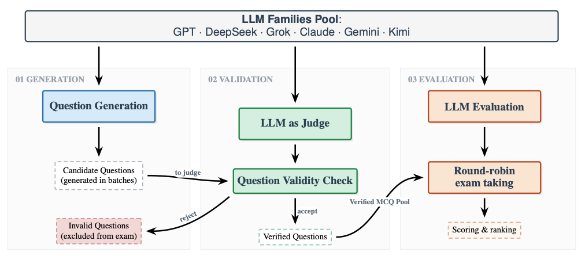

# MedEvalArena

MedEvalArena is a self-generated, peer-judged benchmark for medical reasoning.


[MedEvalArena Leaderboard](https://bernardolab.github.io/MedEvalArena/)

[Substack post](https://danbernardo.substack.com/p/medevalarena)


## Overview of MedEvalArena Framework
- Quiz generation: LLMs produce clinical multiple-choice questions.
- Round-robin evaluation: multiple models answer each other's quizzes; evaluators score responses and aggregate accuracy.
- QuizBench integration: core logic lives in `quizbench/` with bash entrypoints under `v1_scripts/` and `v2_scripts/`.



## Getting started
- Install dependencies:
  With pip
  ```bash
  python -m pip install -r requirements.txt
  python -m pip install -r quizbench/requirements_quizbench.txt
  ```
  With uv (recommended):
  ```bash
  uv pip install -r requirements.txt -r quizbench/requirements_quizbench.txt
  ```

## Example Usage for Question Generation

### 1. Set the API Key

```bash
export GROK_API_KEY="..."
# or
export XAI_API_KEY="..."
````

---

### 2. (Optional) Preview Planned Batches

This step plans the target batches without generating quizzes.

```bash
uv run quizbench/run_batch_gen_quiz.py \
  --config config_grok.yaml \
  --quiz_collection quizzes_Feb2026 \
  --use_target_batches \
  --plan_targets_only
```

---

### 3. Generate Quizzes (Actual Run)

```bash
uv run quizbench/run_batch_gen_quiz.py \
  --config config_grok.yaml \
  --quiz_collection quizzes_Feb2026 \
  --use_target_batches
```

---

### Outputs

Generated outputs will be written to:

* `quizzes/quizzes_Feb2026/`
* `eval_results/quizbench/quizzes_Feb2026/runs/grok-4-0709/`

Paths are determined by the settings in `config_grok.yaml`.

## Usage to run question generation, LLM-as-judge, and question evaluation

### Step 1 Usage to create full dataset (multiple LLM generators)

Pick a **quiz_tag** (the dataset/quiz identifier you want to generate), then run:

```bash
./generate_exam.sh <quiz_tag>
```

*Replace `<quiztag>` with the quiztag you want to generate.*


### Step 2 Usage to evaluate full dataset (multiple LLM generators)
```bash
./eval_judge_round_robin.sh <quiz_tag>
```

### Step 3 (Optional): Check questions
QUIZ_BATCH_TAG=<quiz_tag> bash aggregate_filtered_results.sh

### Step 4: Consolidate
uv run quizbench/refresh_quizbench_manifest.py --runs_root eval_results/quizbench/quizzes_<quiz_tag>/runs --quiz_batch_tag <quiz_tag>

### Step 5: Update accumulated_topic_distribution.json
uv run quizbench/apply_topic_mapping.py \
    --runs_root eval_results/quizbench/quizzes_<quiz_tag>/runs \
    --targets_csv data/ABMS_specialties.csv \
    --operation accumulate \
    --quizzes_dir quizzes/quizzes_<quiz_tag> \
    --topic_map data/topic_to_abms.yaml

### Step 6 (Optional): Go back to step one to generate more questions

## Citation

Prem, P., Shidara, K., Kuppa, V., Wheeler, E., Liu, F., Alaa, A., & Bernardo, D. (2026).
**MedevalArena: A Self-Generated, Peer-Judged Benchmark for Medical Reasoning**.
*arXiv preprint*, submitted January 19, 2026.

### BibTeX

```bibtex
@article{prem2026medevalarena,
  title   = {MedEvalArena: A Self-Generated, Peer-Judged Benchmark for Medical Reasoning},
  author  = {Prem, P. and Shidara, K. and Kuppa, V. and Wheeler, E. and Liu, F. and Alaa, A. and Bernardo, D.},
  journal = {arXiv preprint},
  year    = {2026},
  note    = {Submitted January 19, 2026}
}
```

## Contact
- Danilo Bernardo: dbernardoj [at] gmail [dot] com
